# Settings Tutorial — what each knob does, with pictures

A visual guide to the **3D SIMP → STL** program: what every setting does, how the
**load direction** and **supports** reshape the result, and which settings to pick
for a part you want to optimize. All images below were generated by this repo's
solver on a simple **block** (a Benchy or any uploaded STL behaves the same way —
the shape just becomes the region the material is allowed to live in).

> The mental model: topology optimization keeps material **where the load needs to
> travel to the supports**, and deletes it everywhere else, until you hit your
> material budget. So the two things that change the answer the most are **where
> you clamp it** and **where/which way you push it**.

---

## The workflow (in the app)

1. **Design domain** — a **Box**, or **Upload your own STL** (your shape becomes
   the region material can occupy).
2. **Fixed (clamped) face** — where the part is held.
3. **Loaded face + Load direction** — where the force is applied and which way.
4. **Volume fraction** — how much material to keep.
5. **Penalization / Filter radius** — how crisp and how fine the result is.
6. **Run** → watch it converge → **Download STL** (thresholded, printable).

---

## 1. Supports + Load direction — the biggest lever

Same block, same material budget — only the **load** changes. Notice how the
structure completely reorganizes to carry each load back to the clamped (left) face.

| End load — DOWN | End load — SIDE | Load on TOP |
|:---:|:---:|:---:|
|  | 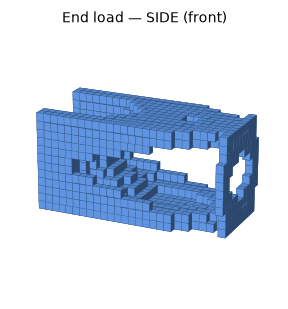 | 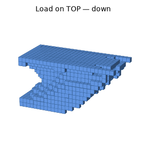 |
| Classic cantilever: a tapered truss/­web forms in the vertical plane of the load. | Push sideways and the bracing rotates into the **horizontal** plane. | Spread the load along the top and you get a broad arch/­rib pattern instead. |

**Takeaway:** set **Fixed face** = where your part actually bolts down, and
**Loaded face + direction** = how it's actually pushed in service. Getting these
right matters far more than any other setting. `-y` is "down", `-z`/`+z` is
sideways, `-x`/`+x` is along the length.

---

## 2. Volume fraction — how much material to keep

Cantilever, everything else fixed — only the material budget changes:

| 0.20 | 0.35 | 0.50 |
|:---:|:---:|:---:|
| 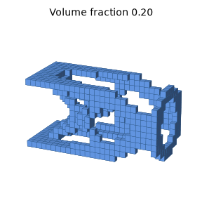 |  | 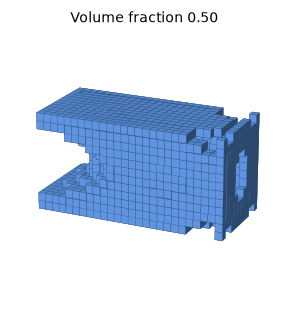 |

Lower = lighter and more skeletal (thinner members, more holes). Higher = heavier
and stiffer, with chunkier members. Start around **0.3–0.4** and adjust for the
strength/weight trade-off you want.

---

## 3. Penalization (`penal`) — crisp part vs. grey mush

This is why SIMP produces a real "solid-or-empty" part. These are **mid-slices of
the density field** (black = solid, white = empty, grey = in-between):

| p = 1.5 (too low) | p = 3.0 (recommended) | p = 5.0 (very aggressive) |
|:---:|:---:|:---:|
| 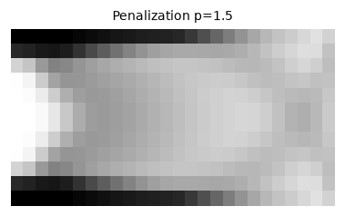 | 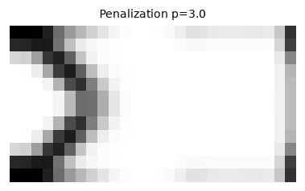 | 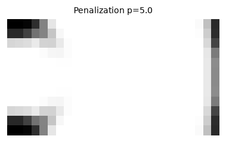 |

Low penalization leaves lots of **grey** intermediate density (not manufacturable —
you can't 3D-print "40% material"). Raising `penal` forces each element toward
**fully solid or fully empty**. **Use `p = 3`** (the standard). Go higher only if
the result still looks grey after thresholding.

---

## 4. Filter radius (`rmin`) — minimum feature size

The filter sets the **smallest member thickness** and keeps the result mesh-
independent. Same problem, three radii:

| rmin = 1.2 (fine) | rmin = 2.5 | rmin = 3.5 (coarse) |
|:---:|:---:|:---:|
| 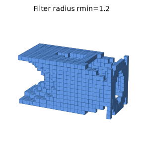 | 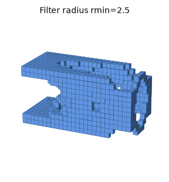 | 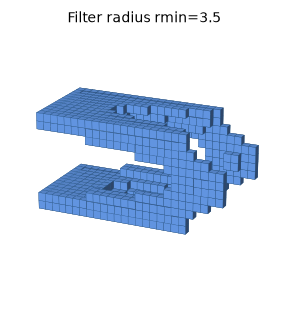 |

Small `rmin` → many thin, delicate struts (can be too fine to print). Large `rmin`
→ fewer, thicker members (more printable, a bit heavier). Pick `rmin` so the
thinnest members are **≥ a few voxels**, matching your printer's minimum feature
size (see `notes.txt`).

---

## 5. Watch it build — iterations

The optimizer starts from a uniform grey block and redistributes material each
iteration until it converges. Here it is at iterations 1, 4, 8, and final:

| it 1 | it 4 | it 8 | final |
|:---:|:---:|:---:|:---:|
| 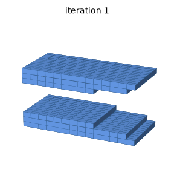 | 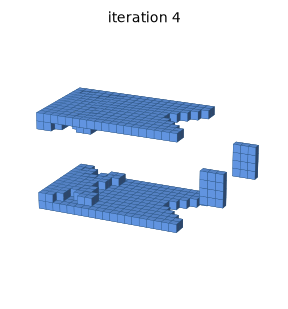 | 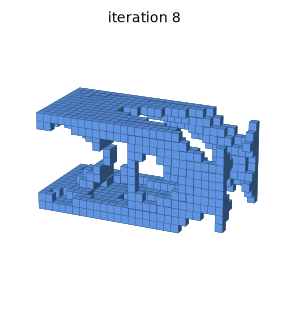 | 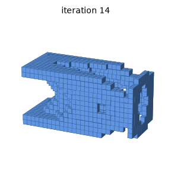 |

**Max iterations**: more iterations = more refined/converged (diminishing returns
after it stops changing). **Resolution** (nelx/nely/nelz, or "voxel resolution"
for an uploaded STL): higher = finer detail but *much* slower (3D FE solves scale
steeply). Start coarse to dial in supports/load, then raise resolution for the
final run.

---

## 6. "I have a part to optimize" — a recipe

1. **Domain:** upload your STL (or pick a box that encloses your part).
2. **Supports:** set **Fixed face** to where the part is bolted/held.
3. **Load:** set **Loaded face + direction** to the real-world force.
4. **Budget:** Volume fraction **0.3–0.4** to start.
5. **Quality:** `penal = 3`, `rmin` so the thinnest strut is ≥ ~3 voxels.
6. **Speed:** start at low resolution + ~15 iterations to check the shape is
   sensible; then raise resolution/iterations for the final.
7. **Export:** keep **STL threshold ≈ 0.5**, download the STL.
8. **Validate:** always FEA-check the printed design (see `notes.txt`).

### Cheat-sheet

| Setting | What it controls | Sensible start | Effect if you raise it |
|---|---|---|---|
| Fixed face | Where it's held | (your bolt face) | — |
| Loaded face + dir | The applied force | (your real load) | reshapes everything |
| Volume fraction | Material kept | 0.3–0.4 | heavier, stiffer |
| Penalization | Solid-vs-void crispness | 3.0 | crisper (less grey) |
| Filter radius `rmin` | Min feature size | 1.5–2.5 | thicker members |
| Resolution | Detail | small first | finer but much slower |
| Max iterations | Convergence | ~15–30 | more refined |
| STL threshold | Solid cutoff for export | 0.5 | less material kept |
